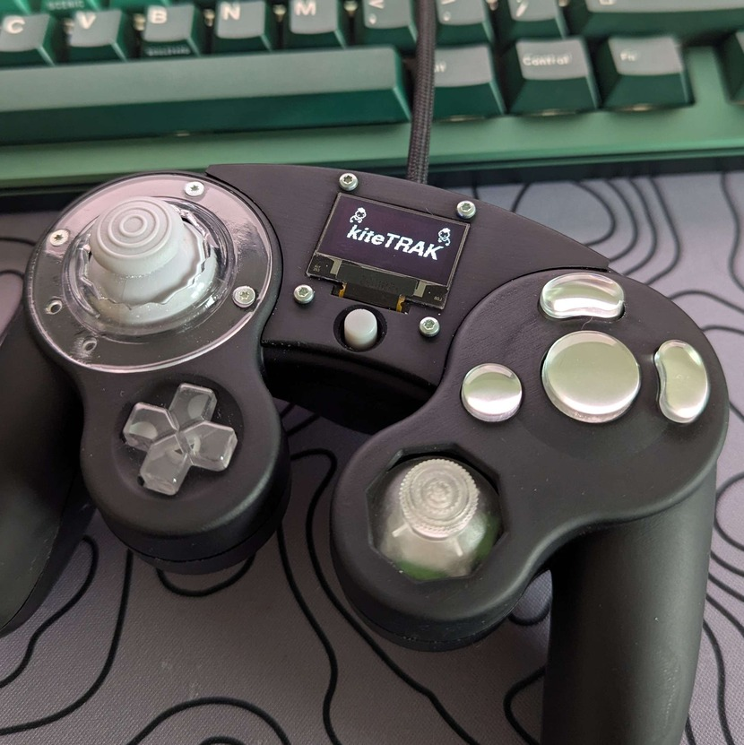
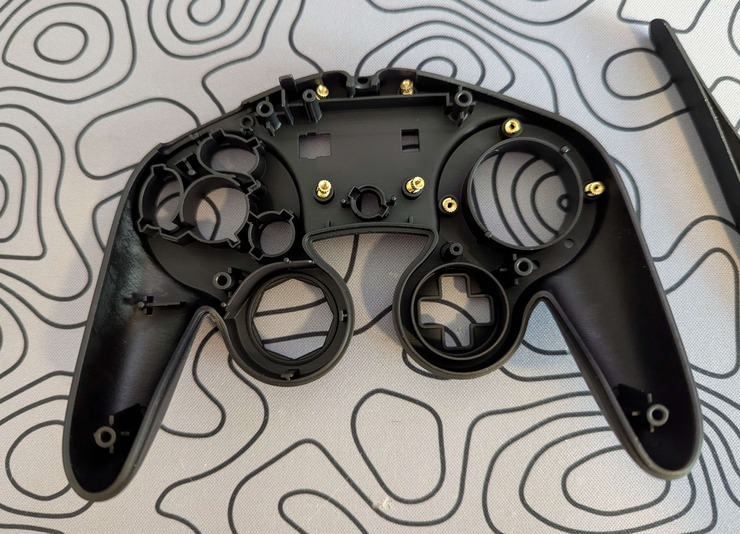
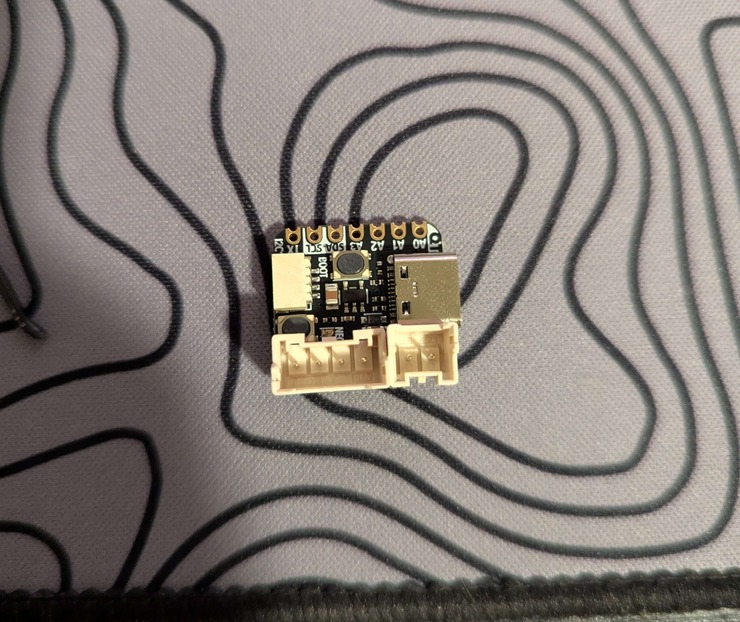
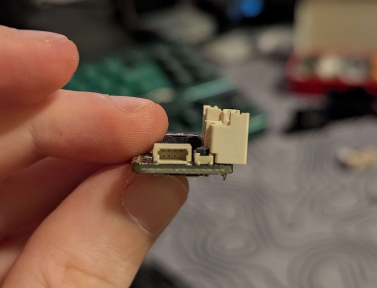

# kiteTRAK-for-PhobGCC

## How it Works
A QtPy RP2040 microcontroller is added to the controller internals to read the PhobGCC state and drive the 128x64 OLED display. The PhobGCC and QtPy RP2040 utilize DMA-based SPI communication for extremely fast speeds without intereupting the PhobGCC, maitaining reliable controller functionality. The QtPy RP2040 and OLED display are powered via the 5V line, replacing the rumble motor. The current draw is measured to be 30-40mA, which is about the same current draw as the rumble motor itself.

Hardware, firmware, and rumble motor bracket 3d model designed by me and top-shell, screen cover, and tall start button 3d models designed by Olympia https://github.com/sean44104 (thank you!).

## Features and Use

### Menu Navigation:
.jpg>)  
* Press Z + D-pad Left/Right to navigate the multiple modes with visuals showing which mode you are about to select
* Releasing Z (or while holding, pressing D-pad Up/Down) will exit the menu navigation into the mode you are seeing
* Pressing Z + D-pad Up/Down will navigate the various views within the mode you are in
    * There is also a lock icon displayed in the top-right to let you know if your Phob if safe mode is enabled (locked icon) or disabled (unlocked icon).

### Button Mode:
.jpg>)  
* View main stick and C stick values with visual display
* View analog trigger values and digital button inputs with visual display
* View dashboard of all analog and digital inputs in one simple look  

### IPM Mode:
.jpg>)  
* View your Inputs per Minute (IPM) with a large number in the center of the screen
* View your IPM with a plot showing its change over time
    * If you reach a high-enough IPM, a Balatro-inspired fire animation will be displayed in either view

### Timer Mode:
.jpg>)  
* Display the total time since your controller has been plugged in

### Animation Mode:
.jpg>)  
* Display a fire animtation
* Display a rain animation
* Display a water puddle reactive animation based on digital controller inputs

### Calibration Mode:
.jpg>)  
* Display a QR code to access the PhobGCC Calibration guide
* Stick Calibration: A guided process to calibrate either stick, while showing you their exact values with a visual aid
    * If you press D-pad down, this will toggle a help menu for what you are doing at each segment of the calibration process
* A/C-Stick Settings: View your settings for X/Y snapback filtering, waveshaping, smoothing, scaling, and cardinal snapping
    * Holding C stick down during this and all following views will show you help and the button inputs needed to adjust all settings shown
* Trigger Settings: View your settings for L/R trigger modes and L/R offset values
* Button Remaps: View your current button remap settings for A, B, D-pad Up, L, R, X, Y, and Z buttons

## Equipment Needed
* Soldering iron
* Desoldering pump/wick
* Flux
* Wire strippers
* Flush cutters
* Y1 Tri-Wing screwdriver
* P1 Philips screwdriver
* T6 Torx screwdriver

## Parts Needed

### Controller:
* PhobGCC 2.x controller
    * If you are making a new PhobGCC controller for this project, refer to the PhobGCC build guide for details: https://phobgcc.com/For_Makers/Build_Guide_2.0.html
* Custom 3D printed components:
    * Top-shell
    * Screen cover
    * Rumble motor bracket
    * Tall start button
    * Olympia removable gateplate: https://github.com/sean44104/Removable-Gate-GCC

If 3D printing parts with JLCPCB, I recommend the following materials and surface finish:
* Top-shell: JLC Black Resin (more durable) or Imagine Black Resin (better surface finish) with General Sanding
* Screen cover: Imagine Black Resin with General Sanding
* Rumble motor bracket: JLC Black Resin with General Sanding
* Tall start button: Grey Resin (replicates look of OEM start button)
* Olympia removable gateplate: 8001 Resin Transparent with Oil Spraying

### Electronics:
* 1x Adafruit QtPy RP2040 microcontroller
* 1x Adafruit Monochrome 0.96" 128x64 OLED Display
* 1x Adafruit 50mm STEMMA QT cable
* 1x 4pin XA JST header (male and female)
* 1x 2pin XA JST header (male and female)
* 3x 6" XA JST jumper cables
    - All parts above can be found in this DigiKey list: https://www.digikey.com/en/mylists/list/08I1ISAMJL

### Hardware:
* 7x M2x0.4mm screw-to-expand press-in inserts (90363A110)
* 3x 6mm M2x0.4mm flat-head Torx screws (90236A104)
* 4x 8mm M2x0.4mm pan-head Torx screws (90304A325)
* Recommended: Mineral oil lubricant (1202K43)
    - Part numbers added to find on McMaster-Carr

## Installation

### Peparing the Top-shell:
1. Press in the 7x screw-to-expand threaded inserts in the following positions with the caps facing up:  

    * Note: If threaded inserts do not press fit with just a little force, use the P1 Philips screwdriver to slowly carve away some of the inner plastic materials in the insert posts. Make sure to only remove a small amount of material at a time to avoide loose inserts.

2. After all inserts are installed, use the pan-head Torx screws to expand and tighten down the inserts until flush:  
.jpg>)

3. Attach the STEMMA QT cable to the right side header of the OLED display and feed it through the gap on the top-shell:  
.jpg>)

4. Press the OLED display into place, add screen cover on-top of display, and use the 4x 8mm pan-head Torx screws to mount the screen to the top-shell:  
.jpg>)
    * Note: If OLED display does not want to fit into the top-shell, you may need to carve some of the top-shell side material where the headers fit into the gaps. Do NOT force the OLED display as it may break.

5. Press your Olympia removable gateplat into the top-shell and use the 3x flat-head Torx screws to mount the gateplate to the top-shell. Once completed, the top-shell assembly should look like this when complete:  
.jpg>)

### Installing the QtPy RP2040:
1. Insert and solder the female XA JST headers to the QtPy RP2040 as shown below:  

    * Note: The headers will be facing opposite directions due to space constraints. Also, the 4pin XA JST header will sit on the ridge of the reset button, make sure it is not being pressed down when installing.

2. Cut the 3x 6" XA JST jumper cables in half to make 6x 3" cables, each with one pin. Strip 4x of the cables to expose the wires on the non-pin ends. Insert and solder the wires into the back-side of the Phob board's GPIO breakout pins lablled GP12-GP15 as shown below:  
.jpg>)

3. Insert the pins into the XA JST male header with the following wires mounting the the following header holes:  
.jpg>)

4. With the 2x remaining wires, cut their length down to ~1.5" and strip the non pin-side to expose the wires. Solder one wire to the '+' side of the rumble pin and the other to the square ground pin of the PhobVision pins, located above the rumble pins. Insert the pins into the XA JST male header, routing the ground connection to the left side and the positive connection to the right side of the header in the following orientation:  
.jpg>)

5. Fit the 4x pin XA JST header through the opening of the rumble motor bracket and move the 2x pin XA JST header out of the way. Insert the trigger boards into place, and press the rumble motor bracket down as below:  
.jpg>)

6. Mount the cable headers into the QtPy RP2040 and move it into the space in the center of the bracket. The installed QtPy RP2040 will sit as shown below:  
.jpg>)
    * Note: Make sure to route the 4x GPIO wires so they are in front of the 'T' post to avoid interfering with the back-shell when closing. Also, the headers should fit into a small recess that dips down towards the board. 

    Now would be a good time to flash the firmware for the Phob board and the QtPy RP2040. Press and hold the reset button on the boards during USB mount to allow flashing the .uf2 files found in Releases. Make sure to only have one USB plugged in at a time when flashing. THIS MAY DAMAGE THE PHOB AND QTPY RP2040.

7. Add buttons, making sure to use the tall start button, and membranes to top-shell. Move the STEMMA QT cable so that it routes upwards between the small wall piece and the controller cable loop post as shown:  
.jpg>)

8. Install Phob board into the top-shell, route STEMMA QT cable back towards the QtPy RP2040, and mount it in the left-side header of the QtPy RP2040. Route the controller cable into place.  
.jpg>)
    * Note: Make sure the STEMMA QT cable avoids interfering with the trigger potentiometer. You can route the slack of the cable in the loop of the GPIO wires as seen above.

9. If you have the mineral oil lubricant, add 1x drop to each of the screw posts of the top-shell, mount the back-shell, and slowly thread the Tri-wing screws into the controller screw posts. After screws are threaded, open the controller and clean up any of the mineral oil that is left behind. Finally, plug in your controller and confirm the display is working!  
.jpg>)

## Project Sources and References
PhobGCC: https://github.com/PhobGCC/PhobGCC-SW  
Olympia removable gateplate: https://github.com/sean44104/Removable-Gate-GCC  
  

---
**Note:** Parts of this project was made with the assistance of AI tools. All generated content has been reviewed and tested by the author, but use it at your own discretion. Graphics were made by myself or credited in the files to who had made them, AI was not used for these purposes.
